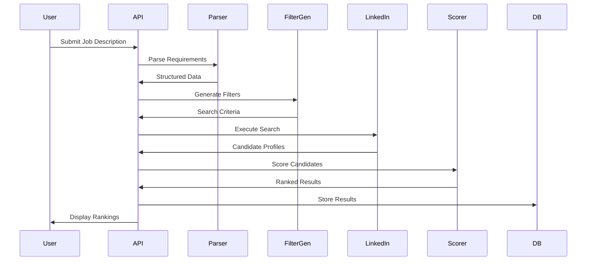

# LinkedIn Candidate Filtering & Ranking System
## High-Level Design Document

---

## 1. System Overview

A intelligent recruitment system that automatically parses job descriptions, generates LinkedIn search filters, retrieves candidate profiles, and ranks them based on job-fit scoring algorithms.

### Core Objectives
- **Automated Parsing**: Extract structured requirements from unstructured job descriptions
- **Intelligent Filtering**: Generate optimal LinkedIn search parameters
- **Smart Ranking**: Score and rank candidates using multi-factor algorithms
- **Scalable Architecture**: Handle multiple concurrent job searches

---

## 2. System Architecture

```
┌─────────────────────────────────────────────────────────────────┐
│                         API Gateway                              │
│                    (Authentication & Rate Limiting)              │
└────────────┬────────────────────────────────────────┬───────────┘
             │                                        │
    ┌────────▼──────────┐                   ┌────────▼──────────┐
    │   Job Parser      │                   │   Web Interface   │
    │     Service       │                   │    (React/Next)   │
    └────────┬──────────┘                   └───────────────────┘
             │                                        │
    ┌────────▼──────────────────────────────────────▼───────────┐
    │                    Orchestration Layer                      │
    │                  (Workflow Management)                      │
    └────┬─────────────┬─────────────┬─────────────┬────────────┘
         │             │             │             │
    ┌────▼────┐   ┌───▼────┐   ┌───▼────┐   ┌───▼────┐
    │ Filter  │   │LinkedIn│   │ Scoring │   │ Export │
    │Generator│   │ Scraper│   │ Engine  │   │Service │
    └─────────┘   └────┬───┘   └─────────┘   └────────┘
                       │
                  ┌────▼────┐
                  │LinkedIn │
                  │   API    │
                  └─────────┘
```

---

## 3. Core Components

### 3.1 Job Description Parser
**Purpose**: Transform unstructured job postings into structured data

**Key Features**:
- NLP-based requirement extraction
- Skill categorization (technical, soft, domain-specific)
- Experience level detection
- Compensation range parsing
- Location and remote work preference extraction

**Technology**:
- OpenAI GPT-4 / Claude API for NLP
- spaCy for entity recognition
- Custom regex patterns for structured data

**Output Schema**:
```json
{
  "role_title": "string",
  "seniority_level": "enum",
  "required_skills": ["string"],
  "preferred_skills": ["string"],
  "years_experience": {
    "min": "number",
    "max": "number"
  },
  "education": {
    "level": "enum",
    "fields": ["string"]
  },
  "certifications": ["string"],
  "location": {
    "cities": ["string"],
    "remote": "boolean",
    "hybrid": "boolean"
  },
  "industry_experience": ["string"],
  "company_size_preference": "enum"
}
```

### 3.2 Filter Generator
**Purpose**: Convert parsed requirements into LinkedIn search parameters

**Key Features**:
- Boolean search query construction
- Dynamic filter combination
- Fallback strategies for rare skills
- Search optimization for API limits

**Filter Mapping Strategy**:
```
Job Requirement → LinkedIn Filter
────────────────────────────────
Role Title → Keywords + Title filters
Skills → Skills filter + Keywords
Experience → Years of experience filter
Education → School/Degree filters
Location → Location radius filter
Industry → Industry filter
Company Size → Company size filter
```

**Output Format**:
```json
{
  "keywords": "string",
  "title_current": ["string"],
  "skills": ["string"],
  "experience_years": {
    "min": "number",
    "max": "number"
  },
  "location": {
    "geo_urn": "string",
    "radius_miles": "number"
  },
  "industries": ["string"],
  "school_names": ["string"],
  "company_sizes": ["enum"]
}
```

### 3.3 LinkedIn Integration Layer
**Purpose**: Interface with LinkedIn for candidate discovery

**Approaches**:
1. **Official API** (LinkedIn Talent Solutions)
   - Pros: Legal, reliable, real-time
   - Cons: Expensive, limited access

2. **Web Scraping** (Selenium/Playwright)
   - Pros: Full access to public data
   - Cons: Rate limits, legal considerations

3. **Hybrid Approach**
   - Use API for initial search
   - Enrich with public scraping

**Rate Limiting Strategy**:
- Request queuing with exponential backoff
- Distributed scraping with proxy rotation
- Caching layer for duplicate requests

### 3.4 Scoring & Ranking Engine
**Purpose**: Evaluate and rank candidates against job requirements

**Multi-Factor Scoring Algorithm**:

```python
# Scoring Components & Weights
SCORE_WEIGHTS = {
    "skill_match": 0.30,        # Technical skills alignment
    "experience_match": 0.20,    # Years & relevance
    "education_match": 0.15,     # Degree & institution
    "industry_match": 0.15,      # Domain expertise
    "location_match": 0.10,      # Geographic fit
    "career_trajectory": 0.05,   # Growth pattern
    "keyword_density": 0.05      # Requirement keywords
}
```

**Scoring Methodology**:

1. **Skill Matching**
   - Exact match: 100 points
   - Synonym match: 80 points
   - Related skill: 60 points
   - Skill embeddings for similarity

2. **Experience Scoring**
   - Years in range: Linear scale
   - Relevance: Cosine similarity of role descriptions
   - Recency bonus: Recent experience weighted higher

3. **Education Scoring**
   - Degree level match
   - Field relevance
   - Institution ranking (optional)

4. **ML Enhancement** (Advanced)
   - Historical hiring data training
   - Success prediction models
   - Bias detection and mitigation

**Output Format**:
```json
{
  "candidate_id": "string",
  "overall_score": 0-100,
  "component_scores": {
    "skill_match": 0-100,
    "experience_match": 0-100,
    // ... other components
  },
  "match_explanation": "string",
  "missing_requirements": ["string"],
  "additional_strengths": ["string"]
}
```

---

## 4. Data Models

### Job Description Model
```typescript
interface JobDescription {
  id: string;
  raw_text: string;
  parsed_data: ParsedJobData;
  created_at: Date;
  company_id: string;
  status: 'active' | 'filled' | 'cancelled';
}
```

### Candidate Profile Model
```typescript
interface CandidateProfile {
  linkedin_id: string;
  name: string;
  headline: string;
  summary: string;
  experience: Experience[];
  education: Education[];
  skills: Skill[];
  certifications: string[];
  score: CandidateScore;
  fetched_at: Date;
}
```

### Search Session Model
```typescript
interface SearchSession {
  session_id: string;
  job_description_id: string;
  filters: LinkedInFilters;
  candidates_found: number;
  candidates_processed: number;
  status: 'running' | 'completed' | 'failed';
  created_at: Date;
  completed_at?: Date;
}
```

---

## 5. System Flow



---

## 6. Technology Stack

### Backend
- **Language**: Python 3.11+ / Node.js (TypeScript)
- **Framework**: FastAPI / Express.js
- **Task Queue**: Celery / Bull
- **Cache**: Redis
- **Database**: PostgreSQL + MongoDB (profiles)

### ML/NLP
- **NLP**: OpenAI API, spaCy, Transformers
- **ML Framework**: scikit-learn, XGBoost
- **Embeddings**: Sentence Transformers

### Infrastructure
- **Container**: Docker
- **Orchestration**: Kubernetes
- **Message Queue**: RabbitMQ / Kafka
- **Monitoring**: Prometheus + Grafana

### Frontend
- **Framework**: Next.js 14
- **UI Library**: Tailwind CSS + shadcn/ui
- **State Management**: Zustand / Redux Toolkit
- **Data Fetching**: TanStack Query

---

## 7. Implementation Phases

### Phase 1: MVP (Weeks 1-4)
- Basic job description parser
- Simple keyword-based filtering
- Manual LinkedIn search integration
- Basic scoring algorithm
- Simple web interface

### Phase 2: Enhanced Parsing (Weeks 5-8)
- AI-powered requirement extraction
- Skill taxonomy integration
- Experience level detection
- Multi-location support

### Phase 3: Advanced Filtering (Weeks 9-12)
- Boolean search optimization
- Synonym expansion
- Related skills mapping
- Dynamic filter adjustment

### Phase 4: Intelligent Ranking (Weeks 13-16)
- ML-based scoring
- Weighted multi-factor algorithm
- Bias detection
- Explainable AI features

### Phase 5: Scale & Optimize (Weeks 17-20)
- Distributed scraping
- Caching layer
- Batch processing
- Performance optimization

---

## 8. Key Algorithms

### 8.1 Skill Matching Algorithm
```python
def calculate_skill_match(required_skills, candidate_skills):
    """
    Fuzzy matching with semantic similarity
    """
    exact_matches = set(required_skills) & set(candidate_skills)

    # Use word embeddings for semantic matching
    unmatched_required = set(required_skills) - exact_matches
    unmatched_candidate = set(candidate_skills) - exact_matches

    semantic_matches = 0
    for req_skill in unmatched_required:
        max_similarity = max([
            cosine_similarity(
                get_embedding(req_skill),
                get_embedding(cand_skill)
            )
            for cand_skill in unmatched_candidate
        ])
        if max_similarity > 0.8:
            semantic_matches += max_similarity

    score = (len(exact_matches) + semantic_matches) / len(required_skills)
    return min(score * 100, 100)
```

### 8.2 Experience Relevance Algorithm
```python
def calculate_experience_relevance(job_desc, candidate_exp):
    """
    TF-IDF + cosine similarity for experience matching
    """
    # Vectorize job description
    job_vector = tfidf_vectorizer.transform([job_desc])

    # Combine candidate experiences
    candidate_text = " ".join([
        exp['description'] for exp in candidate_exp
    ])
    candidate_vector = tfidf_vectorizer.transform([candidate_text])

    # Calculate similarity
    similarity = cosine_similarity(job_vector, candidate_vector)[0][0]

    # Weight by recency
    recency_weight = calculate_recency_weight(candidate_exp)

    return similarity * recency_weight * 100
```

---

## 9. Security & Compliance

### Data Privacy
- GDPR/CCPA compliance
- Data encryption at rest and in transit
- PII anonymization options
- User consent management

### LinkedIn Compliance
- Respect robots.txt
- Rate limiting implementation
- Terms of Service adherence
- Data usage policies

### Security Measures
- API authentication (OAuth 2.0)
- Role-based access control
- Input validation & sanitization
- SQL injection prevention
- XSS protection

---

## 10. Performance Metrics

### System KPIs
- **Parser Accuracy**: >90% requirement extraction
- **Filter Precision**: >80% relevant candidates
- **Ranking Correlation**: >0.7 with human rankings
- **Processing Speed**: <30s per job description
- **API Response Time**: <200ms p95

### Business Metrics
- Time-to-fill reduction
- Quality of hire improvement
- Cost per hire reduction
- Recruiter satisfaction score

---

## 11. Future Enhancements

### Advanced Features
1. **Predictive Analytics**
   - Success probability prediction
   - Retention likelihood scoring
   - Cultural fit assessment

2. **Multi-Platform Integration**
   - Indeed, Glassdoor, AngelList integration
   - GitHub/Stack Overflow activity analysis
   - Portfolio evaluation

3. **AI Interview Assistant**
   - Question generation based on gaps
   - Interview scheduling automation
   - Assessment rubric creation

4. **Diversity & Inclusion**
   - Bias detection in job descriptions
   - Diverse candidate pool enforcement
   - Blind screening options

### Technical Improvements
1. **Real-time Processing**
   - WebSocket connections
   - Server-sent events
   - Live candidate updates

2. **Advanced NLP**
   - Multi-language support
   - Context-aware parsing
   - Intent recognition

3. **Scalability**
   - Microservices architecture
   - Event-driven design
   - Global distribution

---

## 12. Risk Mitigation

### Technical Risks
| Risk | Mitigation |
|------|------------|
| LinkedIn API changes | Multiple integration methods, abstraction layer |
| Rate limiting | Distributed scraping, caching, queuing |
| Data quality issues | Validation layers, manual review options |
| Scaling bottlenecks | Horizontal scaling, load balancing |

### Business Risks
| Risk | Mitigation |
|------|------------|
| Legal compliance | Legal review, Terms of Service adherence |
| Bias in ranking | Bias detection, human-in-the-loop validation |
| Data privacy concerns | Encryption, anonymization, consent management |
| Competition | Unique features, superior UX, faster iteration |

---

## Appendices

### A. API Endpoints
```
POST   /api/jobs/parse
POST   /api/jobs/{id}/search
GET    /api/jobs/{id}/candidates
POST   /api/candidates/{id}/score
GET    /api/sessions/{id}/results
POST   /api/export/csv
```

### B. Database Schema
```sql
-- Core tables structure
CREATE TABLE job_descriptions (
    id UUID PRIMARY KEY,
    raw_text TEXT,
    parsed_data JSONB,
    company_id UUID,
    created_at TIMESTAMP
);

CREATE TABLE candidates (
    id UUID PRIMARY KEY,
    linkedin_id VARCHAR(255) UNIQUE,
    profile_data JSONB,
    last_updated TIMESTAMP
);

CREATE TABLE search_sessions (
    id UUID PRIMARY KEY,
    job_id UUID REFERENCES job_descriptions(id),
    filters JSONB,
    status VARCHAR(50),
    created_at TIMESTAMP
);

CREATE TABLE candidate_scores (
    id UUID PRIMARY KEY,
    session_id UUID REFERENCES search_sessions(id),
    candidate_id UUID REFERENCES candidates(id),
    overall_score DECIMAL(5,2),
    component_scores JSONB,
    created_at TIMESTAMP
);
```

---

*Version 1.0 | Last Updated: 2024*